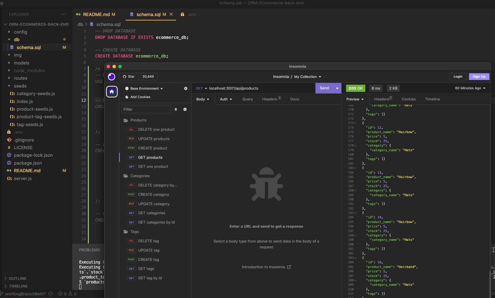

# ORM-Ecommerce-back-end

## Technologies


## Description
Back end for an e-commerce site using Express.js API configured to use Sequelize to interact with a MySQL database

## Installation
**Requirements**

[Node.js](https://nodejs.org/en/) | [MySQL2](https://www.npmjs.com/package/mysql2) | [Sequelize](https://www.npmjs.com/package/sequelize) | [Express.js](https://expressjs.com/)

1. Clone the repository at the gitHub in the link section below
2. Open new session of terminal/shell, launch sql and within sql run ```source db/schema.sql```
3. Leave sql and seed db by running ```node seeds/index.js```
4. Then open server by running ```apm start```
5. Now you can use insomnia or postman at localhost:3001 

## User Story
```
AS A manager at an internet retail company
I WANT a back end for my e-commerce website that uses the latest technologies
SO THAT my company can compete with other e-commerce companies
```

## Acceptance Criteria
```
GIVEN a functional Express.js API
WHEN I add my database name, MySQL username, and MySQL password to an environment variable file
THEN I am able to connect to a database using Sequelize
WHEN I enter schema and seed commands
THEN a development database is created and is seeded with test data
WHEN I enter the command to invoke the application
THEN my server is started and the Sequelize models are synced to the MySQL database
WHEN I open API GET routes in Insomnia Core for categories, products, or tags
THEN the data for each of these routes is displayed in a formatted JSON
WHEN I test API POST, PUT, and DELETE routes in Insomnia Core
THEN I am able to successfully create, update, and delete data in my database
```

## Screenshot


## Video
Video Links:
- [GET example](https://watch.screencastify.com/v/IseF0YPuJB75KOf9bxWa)
- [POST example](https://watch.screencastify.com/v/IkyJjRURaCjskJlY5STL)
- [DELETE example](https://watch.screencastify.com/v/tG9ezhUbglamAiWnVvIK)
- [PUT example](https://watch.screencastify.com/v/XjJY9GlAMEP1Qa63udqb)


## Link
A link to the [code](https://github.com/betheng/ORM-Ecommerce-back-end):
```
https://github.com/betheng/ORM-Ecommerce-back-end
```

## License
  
  Licensed under the [MIT](LICENSE) license.

## Contact
Creators GitHub link [code](https://github.com/betheng ):
```
https://github.com/betheng 
```